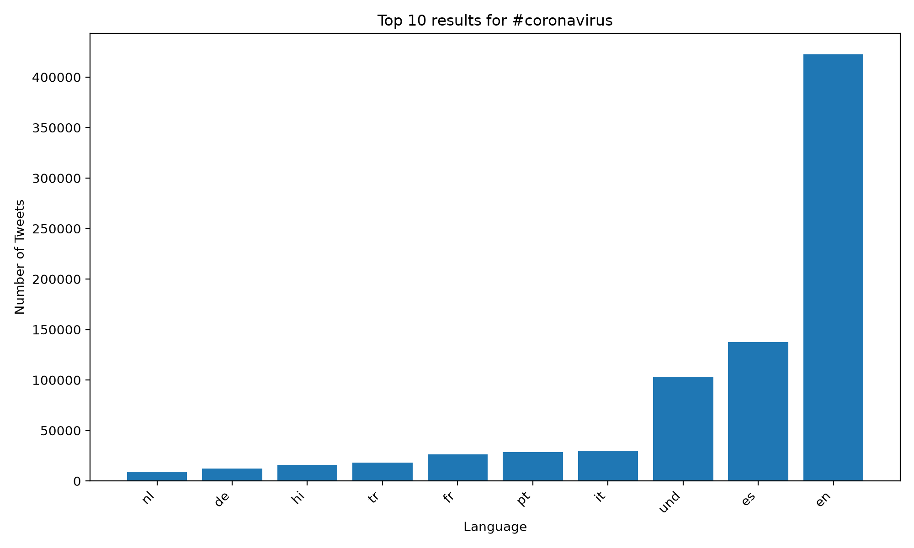
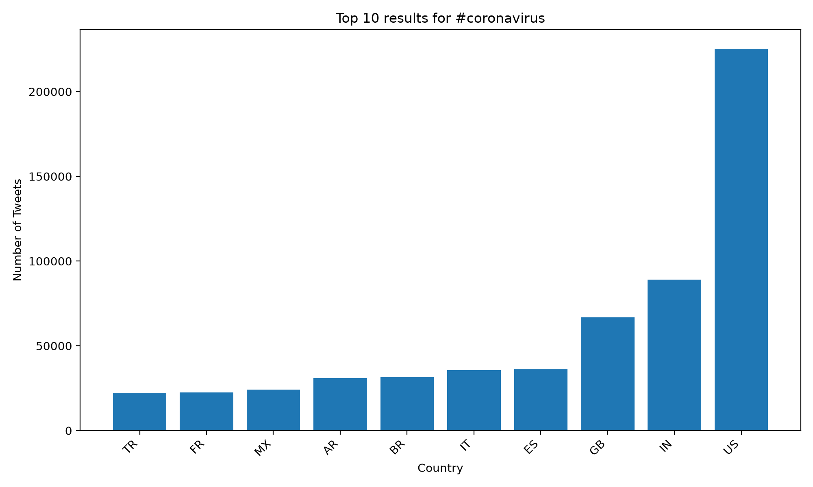
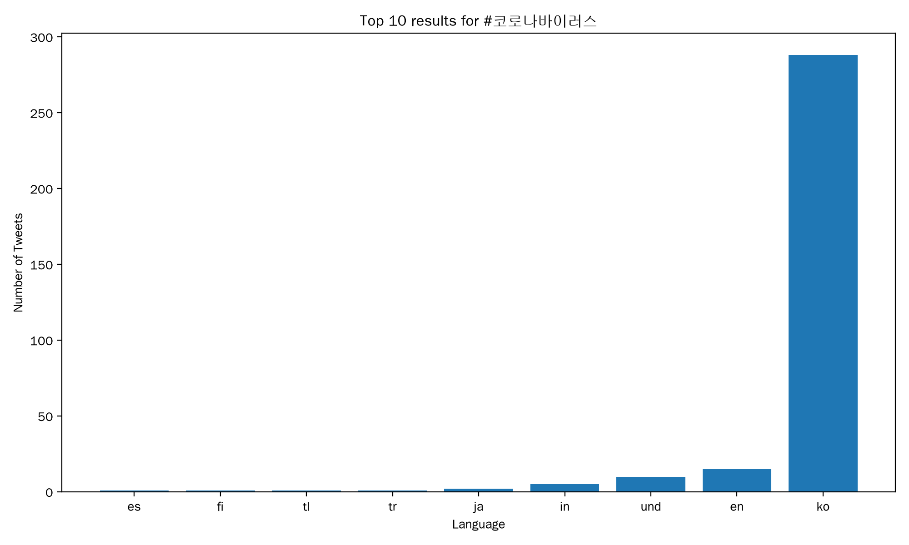
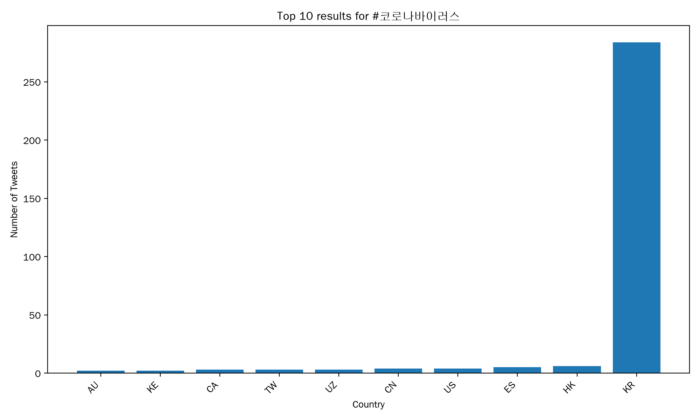
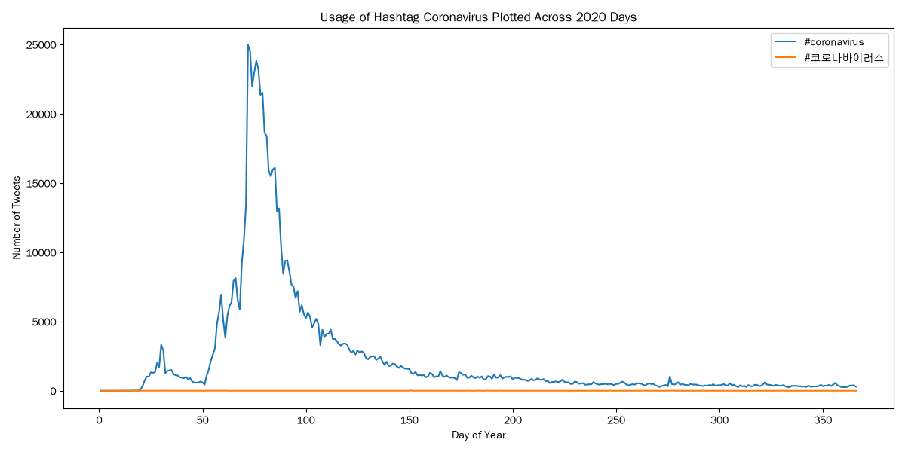

# Coronavirus Twitter Analysis

This project analyzes a large-scale dataset of all geotagged tweets across all of 2020. In it, I study how coronavirus-related hashtags were used across languages, countries, and time.

The dataset I'm working with is huge: it contains hundreds of millions of geotagged tweets. I processed the data using a MapReduce pipeline implemented in a combination of Python and bash. To do this, I mapped Daily Twitter archives independently and in parallel, producing hashtag counts grouped by language and country. I ran these jobs by parallelizing them across 2020 date and then reduced those daily outputs into aggregate datasets and visualized the results with Python and Matplotlib.

The project demonstrates fundamental knowledge of large-scale data processing, Unix process control, parallel computation, JSON processing, multilingual text analysis, and data visualization.

## Coronavirus by Language

## Coronavirus by Country

## Korean Coronavirus Hashtag by Language

## Korean Coronavirus Hashtag by Country

## Hashtag Usage Over Time

The time-series visualization shows how usage of selected coronavirus hashtags changed over the course of 2020.
